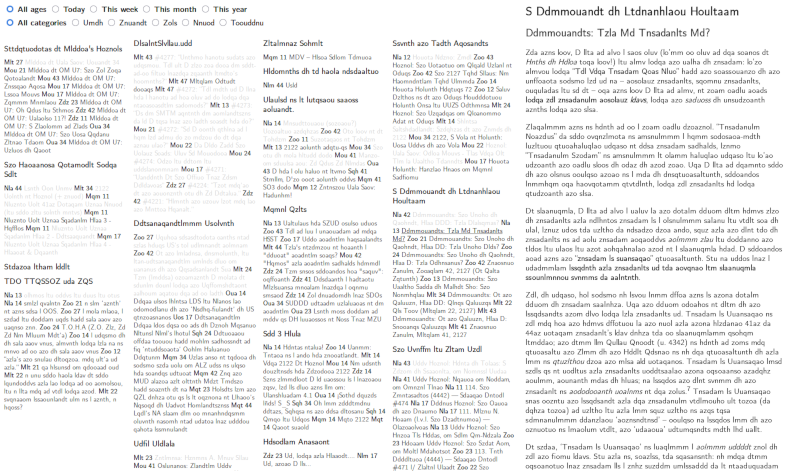

# tonguefish

Yet another static RSS and Atom feed aggregator



## What's this?

This is a static generator which produces an extremely compact bird's-eye view of all your feeds on a single webpage.

## That sounds like a lot of stuff on one page.

Image links in item content are rewritten to load lazily, so that they are only fetched if you view the item, and `tonguefish` can request resized images from servers that offer them. However, if you have lots of feeds or your feeds are very busy, you can configure limits on how many entries are included. See below for details.

## Why's it called `tonguefish`?

Because it's flat.

# Basic features

Hovering over titles displays the content provided in the feed. You can filter the results by age (approximate) and by category.

All the navigation is done with pure CSS (no JavaScript), so you can use this without a webserver, by opening a local file.

There is no state; links appear as visited or unvisited according to your browser history. This is imperfect for various reasons, but a core design principle: it's trivial to implement, and eliminates the inbox zero mentality (which I personally dislike) from feed browsing.

Feeds are configured in a [TOML](https://toml.io/en/) file. Currently there is no tool for adding a feed from a URL, or for importing feeds from an OPML file, but I may add this option to the script.

The page can be configured to refresh periodically using a meta header. Updating the feeds has to be configured separately (for example with `cron`).

Parsed feed objects are pickled and saved in a cache. `tonguefish` attempts to use an eTag and / or `Last-Modified` header from the cached object to avoid downloading a feed that hasn't changed.

`tonguefish` detects when a feed has redirected permanently or been removed, and edits the config file to update or disable the URL, respectively.

## Basic feed configuration

Please refer to the [TOML documentation](https://toml.io/en/latest) for an overview of the TOML syntax.

Feeds are listed in a TOML AoT (array of tables).

```toml
[[feeds]]
url = "https://example.com/rss"
category = "blog"
```

Most feed options can be specified globally (at the top level), in a category section, in a group section, or in a single feed (although some of these options may not make sense).

A more specific option will take precedence over a more general one. The usual order of precedence is: feed, group, category, global. Exceptions and edge cases are documented in more detail below.

Category and group keys may only contain lowercase letters and underscores. Category and group names used elsewhere in the confguration are normalized to this format when they are matched to keys: spaces are replaced with underscores and other characters are removed.

```toml
[categories.blog]
max_entry_num = 20

[categories.blog.digest]
interval = "week"
```

### URL

Each table in the `feeds` array must contain an URL. This property can only be set at the feed level. Tonguefish automatically updates the configuration if a feed moves permanently or is removed permanently.

### Category

A feed may have exactly one category. This property can be set at the feed, group or global level, but a category cannot be set at the category level.

A group category must be set at the group level. Categories set on individual feeds in the group will be ignored.

## Transformations

`tonguefish` can perform transformations on feeds to fix certain annoyances. 

### Limits

You can set limits on the maximum age of entries (in days) to be included, and/or the maximum number of entries to be included per feed.

You can set the `full_content` option to include the full text content of each entry, rather than just the summary (by default it's unset). However, there is no consistency in the way that different feeds use these fields: some don't provide the full content, and some put the full content *in* the summary, so either way you will probably see a mixture of content lengths. The option may be more helpful as a per-feed setting.

`tonguefish` recognises some image URLs as being rewritable to request a smaller image size from the server (the list is being expanded on a case-by-case basis). Set `max_img_width` to enable this (adjust the value to the typical pixel width of the feed preview area in your browser window).

```toml
# Set a global limit on the number of entries to include in each feed (0 to disable)
max_entry_num = 10

# Set a global limit on the age of entries to include in each feed (0 to disable)
max_entry_age = 365 # days

# Include full content of entries, if it's available
full_content = 1

# Resize images to this width before fetching, if possible
max_img_width = 500 # px

[[feeds]]
url = "https://example.com/rss"

# Include more entries from this feed
max_entry_num = 20

# No age limit on entries from this feed
max_entry_age = 0

# Don't include the full content from this feed
full_content = 0
```

These properties can be set at any level. `full_content` and `max_img_width` are applied when the original entry content is generated. `max_entry_age` is applied when the final entries are filtered. `max_entry_num` is applied to the final entries after all other filtering.

### Title

The feed can be renamed.

```toml
[[feeds]]
url = "https://example.com/rss"
title = "Cool Example Feed"
```

This property cannot be set at the top level. In a category or group section, `title` sets the display name for the category or group. It is applied when the original entry content is generated.

### Bad dates

If a feed has publication dates in a format that `feedparser` doesn't recognise, you can specify your own format (to pass to `strptime`).

If a feed had publication dates in its local time rather than UTC, you can specify the timezone (using the same formats as your local timezone at the top level; see below).

```toml
[[feeds]]
url = "https://example.com/whatarestandards/rss"
date_format = "%A %b %d %Y %H:%M:%S"
timezone = "Africa/Johannesburg"
```

These properties can also be set at the group level. They are applied when the original entry content is generated.

### Sorting

If a feed isn't sorted newest-first, which is a problem if you want to limit the number of entries, you can enforce this ordering using the `sort` option.

```toml
[[feeds]]
url = "https://example.com/randomorder/rss"
sort = 1
```

This property can be set at any level. It is applied when the final entries are generated, before the number limit is applied. Digests always sort the original entries.

### Ignore

You can ignore entries that match certain patterns. Each set of ignore rules is a subtable which has to have a name and can have one regex rule per field. The `ignore` preference is merged like other preferences -- rulesets with the same name will override one another. You can combine multiple regexes in one field in one ruleset with `|`, or add multiple different rulesets.

Use `content` to search whatever field `tonguefish` decides to use as the content, and `link` to search whichever link `tonguefish` picks for the entry. Otherwise, any field that `feedparser` understands will be checked directly -- but it may not exist for certain feeds.

```toml
[[feeds]]
url = "https://example.com/rss"

[feeds.ignore.cheese]
title = '[Ch]eese'
content = 'gouda|cheddar|gorgonzola'
```

This property can be set at any level. It is applied after the original entries are generated.

### Strip text

You can strip text from the entry title or entry content using a regular expression. Bear in mind that if the content shown for the feed is HTML, you need to take the HTML structure into account. The format of the strip rules is the same as the format for the ignore rules. Absolutely no validation of the resulting HTML is done; use this with care.

```toml
[[feeds]]
url = "https://example.com/rss"

[feeds.strip.annoyingprefix]
title = '^Annoying Prefix \|'
content = '<p>Start Of Ad.*End!</p>'
```

This property can be set at any level. It is applied when the original entry content is generated.

### Digest

Multiple entries from one feed can be aggregated into digests (hourly, daily, weekly, or monthly). The intended use case is magazines which have no issue feed but post multiple entries for a single issue on one day, or over the course of a month, or webcomics which post a batch of updates at a time. An hourly digest could be useful for a very busy feed.

You can configure rules for extracting an identifier from a field in one of the component entries (entries will be checked until the first match is found) and using it to construct an aggregate link and title. If the oldest entry with this information falls off the end of the feed, the preceding entries which would be in the same digest will be discarded unless you set the `partial` property, which will cause them to be included with the fallback title and URL, which are copied from the first (oldest) item in the digest.

```toml
[[feeds]]
url = "https://example.com/comic/rss"

[feeds.digest]
interval = "day"

[[feeds]]
url = "https://example.com/magazine/rss"

[feeds.digest]
interval = "month"
id_source = "link"
id_find = 'https://example.com/magazine/editorial_issue_(\d+)/'
link = 'https://example.com/magazine/issues/\1/'
title = 'Issue \1'
```

This property can be set at any level, but individual feeds inside a group don't inherit digest settings from the group (or digest settings that the group has inherited) -- those settings are applied to the whole group feed. If you really want to apply a digest to a single feed inside a group, it must be specified at the feed level.

Single feed digests are applied after the original feed entries are generated. Group digests are applied after the group entries are aggregated.

### Group

Entries from multiple feeds can be aggregated into a single feed. The intended use case is grouping individual account feeds from a website which does not offer a single feed for all your subscriptions.

```toml
[[feeds]]
url = "https://example.com/comic/rss"
group = "example"
title = "Cool example feeds"

[[feeds]]
url = "https://example.com/magazine/rss"
group = "example"

[[feeds]]
url = "https://example.com/news/rss"
group = "example"

[groups.example]
title = "Cool example feeds"
category = "media" 
```

The group property can only be set at the feed level, and is invalid everywhere else.

`title` and `digest` preferences set in the group section are applied to the combined group feed only and not inherited by individual feeds in the group. The group category must be set in the group section; categories set in individual feeds will be ignored.

Other properties (such as ignore rules) set at the group level will be merged into the individual feed preferences.

Group entries are aggregated after original feed entries have been generated and after any individual feed digests have been applied.

### Hide

You can prevent a feed from appearing in the main `All categories` view (you can still see it if you select the category it belongs to). It makes the most sense to do this for an entire category.

```toml
[categories.news]
hide = 1
```

This property is valid at any level. It will only affect a group if it is set at the group level or above. 

### Order of transformations

1. Original entry content is parsed
2. Images and videos are modified
3. Strip rules are applied
4. Ignore rules are applied
5. Single-feed digests are generated
6. Groups are aggregated
7. Group digests are generated
8. `max_entry_age` limits are applied
9. `max_entry_num` limits are applied

## How to use

### Prerequisites

`tonguefish` needs Python 3, [`feedparser`](https://feedparser.readthedocs.io/en/latest/) and [`tomlkit`](https://tomlkit.readthedocs.io/en/latest/). On Windows you will also need the `tzdata` package if you want to use IANA strings to configure local timezones.

You need to provide an input directory (the default is `./input`), which must contain at minimum a `feeds.toml` file and a copy of or symbolic link to the `tonguefish.css` stylesheet. `tonguefish` also uses an output directory (default: `./output`), a cache directory (default: `./cache`), and a temp directory output(default: `/tmp`).

Custom CSS can be placed in separate files in the input directory; they will be copied to the output directory. Any files called `favicon.*` (any suffix) in the input directory will be copied to the output directory and used as favicons. A default is provided (you have to copy or symlink it, like the default stylesheet).  The `tonguefish.py` script is standalone, and can be run from / moved to any working directory (just remember to specify the paths to all the locations correctly).

`tonguefish` can be run with all downloads disabled (useful for changing configuration of existing feeds, or development of `tonguefish` itself), or with updates disabled but fetching of missing feeds enabled (useful for adding new feeds).

Because the page doesn't use any JavaScript, you can use it without a webserver, just by opening the file in your browser. Because the browser syncs visited state for you, you can run a copy locally on each device (you only have to sync your `feeds.toml` and any custom CSS). You can also host it on a webserver if you want to, but that's outside the scope of these instructions.

### Install

These are example instructions for Linux (a recent Ubuntu LTS release). `tonguefish` has not been tested on other operating systems; it probably works anywhere you can install Python 3.

You should probably do this inside a virtualenv instead of using `sudo`; do as I say, not as I do.

```shell
# Get the Python dependencies
sudo pip install feedparser tomlkit

# Get the repository
git clone https://github.com/confluence/tonguefish.git
```

### Configure

```shell
cd tonguefish
mkdir input

# Set up basic config
ln -s ../tonguefish.css input
ln -s ../favicon.svg input

# Now edit feeds.toml to add your feeds
vim input/feeds.toml
```

### Run

```shell
# Run tonguefish
./tonguefish.py

# Open the generated webpage in your preferred browser
xdg-open output/index.html
```

### Adjust feed configuration

Once your current feeds have been downloaded and cached, you can re-run `tonguefish` with updates disabled while refining your configuration, so that you can reuse the cached feeds without constantly re-downloading, which would be annoying both for you and for the servers.

```shell
# Edit feeds.toml
vim input/feeds.toml

# Run tonguefish with all downloads disabled
./tonguefish.py --action generate
```

### Configure local time

If you're running `tonguefish` on a local computer, you can probably just let it guess the local time offset from your system. If you're running it on a remote computer in a different time zone, you can configure a specific local time for it to use.

```toml
# Set a timezone (IANA string)
timezone = "Africa/Johannesburg"

# Set a timezone (fixed hour offset)
tzoffset = 2
```

### Set up updates

Once you're happy with your configuration, you can make `tonguefish` run at regular intervals. Here is an example that configures your local user's `cron` to run `tonguefish` every hour on the hour.

```shell
# Edit your crontab
crontab -e
```

Enter this line (substituting full paths as appropriate), and save the crontab:

```cron
@hourly cd /path/to/tonguefish/dir'; ./tonguefish.py >> /path/to/logfile 2>&1
```

A log can be useful for debugging, but if you don't want to log output, replace `>> /path/to/logfile` with `> /dev/null`. By default `tonguefish` will only print warnings and errors.

### Set up page refresh

You can configure a refresh interval in seconds at the top level of `feeds.toml`.

```toml
# How often to refresh the page (0 to disable; this does NOT update the feeds; you have to configure that elsewhere)
refresh_interval = 600 # seconds
```

Technically you don't need to refresh more frequently than the feed update interval, but since it's difficult to align these events perfectly, I recommend refreshing a couple of times per update to make sure that you pick up changes within a reasonable time frame.

### Add a new feed

Edit `feeds.toml` to add your new feed, and then run `tonguefish` with updates disabled and fetching of new feeds enabled.

```shell
# Edit feeds.toml
vim input/feeds.toml

# Run tonguefish with updates disabled and fetching of new feeds enabled
./tonguefish.py --action new
```

### Troubleshooting

You can run `tonguefish` with increased verbosity to see more information.

```shell
# Show info messages
./tonguefish.py -v

# Show debug messages
./tonguefish.py -vv
```

## Future work

I hacked this together in a couple of days, and it's very alpha, but it's usable (at least by me). I'm eating the cat food -- expect rapid bursts of development as I subscribe to new feeds and find more things that break.

### Likely upcoming changes

**Display**

* Incorporation of more data from feeds and entries (e.g. direct links to media) and more information about current feed configuration
* Style improvements
* More feed customisation options
* Ordering of feeds (currently the order in the configuration is preserved, except that group feeds are added at the end)
* *Maybe* some tasteful use of colour and icons in the main list

**Conf file modification**

* Script option to add a new feed
* Script option to add missing feed titles to config (so that you can identify mystery meat URLs in the file if you didn't bother to annotate them with comments when you added them)
* Other script options to normalize the config file

**Technical**

* More code refactoring and cleanup
* Fetching and caching the data first, and then writing the index page (also see below).

### Known issues

* Extra files are not removed from the output directory (could cause problems with stylesheets or favicons).
* If the Python bindings for `libxml2` are installed, `feedparser` uses a more strict parser which chokes on feeds with missing namespace declarations. I'm going to see how best to fix this. In the meantime, a workaround (if you can't uninstall the bindings or use a virtualenv) is to automate downloading the feed to a local file and fixing the namespace, and use the local file path in the config instead.
* The unpickled objects are not checked for correctness; something weird may happen if the version of Python and/or `feedparser` changes. I suggest clearing the cache between upgrades.
